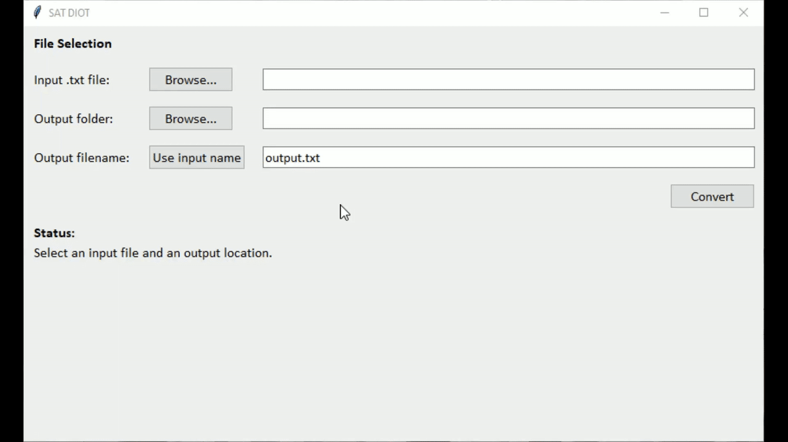

# SAT-Converter

A lightweight utility with GUI that takes metadata from one SAT's file, transforms it into the required format, and outputs a `.txt` file ready for upload into their DIOT ingestion system.

## Demo

    

